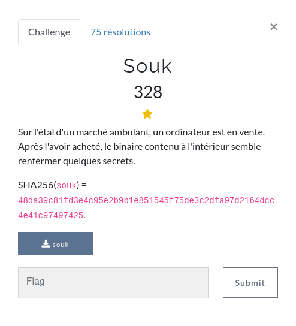
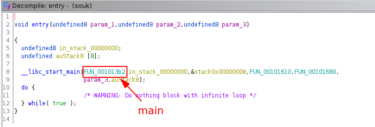
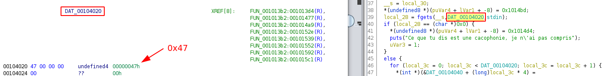
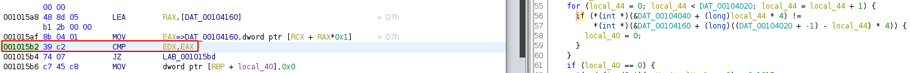

# Souk




## Analyse Statique

Pour commencer voyons voir à quel genre de binaire nous avons affaire :

```
$ file souk 
souk: ELF 64-bit LSB shared object, x86-64, version 1 (SYSV), dynamically linked, interpreter /lib64/ld-linux-x86-64.so.2, BuildID[sha1]=5f294f298b0dada7b2a02c87bc9c589729ad1630, for GNU/Linux 3.2.0, stripped
```

On voit que c'est un **ELF-64bit stripped**.

Pour trouver la fonction **main** on va ouvrir ghidra et voir la fonction pris en argument par **__libc_start_main()** :



Fonction **main** :

```c
undefined8 FUN_001013b2(void)

{
  long lVar1;
  char *__s;
  ulong uVar2;
  undefined8 uVar3;
  undefined *puVar4;
  long in_FS_OFFSET;
  undefined auStack72 [4];
  int local_44;
  int local_40;
  int local_3c;
  long local_38;
  char *local_30;
  char *local_28;
  long local_20;

  local_20 = *(long *)(in_FS_OFFSET + 0x28);
  local_38 = (long)DAT_00104020 + -1;
  uVar2 = (((long)DAT_00104020 + 0xfU) / 0x10) * 0x10;
  for (puVar4 = auStack72; puVar4 != auStack72 + -(uVar2 & 0xfffffffffffff000);
      puVar4 = puVar4 + -0x1000) {
    *(undefined8 *)(puVar4 + -8) = *(undefined8 *)(puVar4 + -8);
  }
  lVar1 = -(ulong)((uint)uVar2 & 0xfff);
  if ((uVar2 & 0xfff) != 0) {
    *(undefined8 *)(puVar4 + ((ulong)((uint)uVar2 & 0xfff) - 8) + lVar1) =
         *(undefined8 *)(puVar4 + ((ulong)((uint)uVar2 & 0xfff) - 8) + lVar1);
  }
  local_30 = puVar4 + lVar1;
  *(undefined8 *)(puVar4 + lVar1 + -8) = 0x101491;
  memset(puVar4 + lVar1,0,(long)DAT_00104020);
  *(undefined8 *)(puVar4 + lVar1 + -8) = 0x1014a2;
  printf("Quel est le mot de passe ? ");
  __s = local_30;
  *(undefined8 *)(puVar4 + lVar1 + -8) = 0x1014bd;
  local_28 = fgets(__s,DAT_00104020,stdin);
  if (local_28 == (char *)0x0) {
    *(undefined8 *)(puVar4 + lVar1 + -8) = 0x1014d4;
    puts("Ce que tu dis est une cacophonie, je n\'ai pas compris");
    uVar3 = 1;
  }
  else {
    for (local_3c = 0; local_3c < DAT_00104020; local_3c = local_3c + 1) {
      *(int *)(&DAT_00104040 + (long)local_3c * 4) =
           *(int *)(&DAT_00104040 + (long)local_3c * 4) + (int)local_30[local_3c];
    }
    *(undefined8 *)(puVar4 + lVar1 + -8) = 0x101552;
    FUN_00101316(&DAT_00104040,DAT_00104020,0);
    *(undefined8 *)(puVar4 + lVar1 + -8) = 0x10156b;
    FUN_00101316(&DAT_00104160,DAT_00104020,1);
    local_40 = 1;
    for (local_44 = 0; local_44 < DAT_00104020; local_44 = local_44 + 1) {
      if (*(int *)(&DAT_00104040 + (long)local_44 * 4) !=
          *(int *)(&DAT_00104160 + (long)((DAT_00104020 + -1) - local_44) * 4)) {
        local_40 = 0;
      }
    }
    if (local_40 == 0) {
      *(undefined8 *)(puVar4 + lVar1 + -8) = 0x1015ec;
      puts(&DAT_001020d0);
    }
    else {
      *(undefined8 *)(puVar4 + lVar1 + -8) = 0x1015de;
      puts(&DAT_00102060);
    }
    uVar3 = 0;
  }
  if (local_20 != *(long *)(in_FS_OFFSET + 0x28)) {
                    /* WARNING: Subroutine does not return */
    __stack_chk_fail();
  }
  return uVar3;
}
```

On voit pas mal de chose dans cette fonction **main**. Pour commencer on voit la fonction **fgets()** appelé à la ligne 39.

Elle prend en argument le pointeur vers lequel le mot de passe sera stocké **__s**, la taille du buffer **DAT_00104020** et le flux de lecture **stdin**.

**DAT_00104020** vaut 0x47 soit 71 :



On peut donc en déduire que la taille du mot de passe est de 70 caractères.

Ensuite on voit une boucle réalisé 70 fois ligne 46.

Cette boucle va modifier les valeurs d'un tableau (&DAT_00104040) et va les incrémenter avec la valeur décimal ascii des caractères du mot de passe rentré.

Ensuite deux fonctions sont appelé.

Le 1er prennant en argument le même tableau modifié (&DAT_00104040), 0x47 et 0.

Le 2ème prennant en argument un autre tableau (&DAT_00104160), 0x47 et 1.

Ensuite une boucle est effectué ligne 55 et une comparaison est réalisé pour vérifié si le mot de passe est correct.

Si le mot de passe est incorrect on aura le droit à un message d'échec :( :

> Réessaie, peut-être que tu trouveras comment sortir de ce bazar.

Sinon :

> Bravo, tu as réussi à mettre de l'ordre dans ce capharnaüm...
> Tu peux valider le challenge avec ce flag !

## 

## Analyse dynamique

Maintenant qu'on à rapidement vu ce que faisait le fonction **main** allons faire un peu d'analyse dynamique avec pwndbg :D.

Pour commencer avec l'analyse dynamique on va récupérer l'adresse de la fonction **main** :

```
pwndbg> r
Starting program: /home/fayred/Documents/ctf/FCSC/wu/FCSC 2022/RE/souk/souk 
Quel est le mot de passe ? 
Réessaie, peut-être que tu trouveras comment sortir de ce bazar.
[Inferior 1 (process 739867) exited normally]
pwndbg> info files
Symbols from "/home/fayred/Documents/ctf/FCSC/wu/FCSC 2022/RE/souk/souk".
Local exec file:
    `/home/fayred/Documents/ctf/FCSC/wu/FCSC 2022/RE/souk/souk', file type elf64-x86-64.
    Entry point: 0x5555555550e0
    0x0000555555554318 - 0x0000555555554334 is .interp
    0x0000555555554338 - 0x0000555555554368 is .note.gnu.property
    0x0000555555554368 - 0x000055555555438c is .note.gnu.build-id
    0x000055555555438c - 0x00005555555543ac is .note.ABI-tag
    0x00005555555543b0 - 0x00005555555543d8 is .gnu.hash
    0x00005555555543d8 - 0x00005555555544f8 is .dynsym
    0x00005555555544f8 - 0x00005555555545af is .dynstr
    0x00005555555545b0 - 0x00005555555545c8 is .gnu.version
    0x00005555555545c8 - 0x00005555555545f8 is .gnu.version_r
    0x00005555555545f8 - 0x00005555555546d0 is .rela.dyn
    0x00005555555546d0 - 0x0000555555554748 is .rela.plt
    0x0000555555555000 - 0x000055555555501b is .init
    0x0000555555555020 - 0x0000555555555080 is .plt
    0x0000555555555080 - 0x0000555555555090 is .plt.got
    0x0000555555555090 - 0x00005555555550e0 is .plt.sec
    0x00005555555550e0 - 0x0000555555555685 is .text
    0x0000555555555688 - 0x0000555555555695 is .fini
    0x0000555555556000 - 0x0000555555556113 is .rodata
    0x0000555555556114 - 0x0000555555556170 is .eh_frame_hdr
    0x0000555555556170 - 0x00005555555562e0 is .eh_frame
    0x0000555555557d98 - 0x0000555555557da0 is .init_array
    0x0000555555557da0 - 0x0000555555557da8 is .fini_array
    0x0000555555557da8 - 0x0000555555557f98 is .dynamic
    0x0000555555557f98 - 0x0000555555558000 is .got
    0x0000555555558000 - 0x000055555555827c is .data
    0x0000555555558280 - 0x0000555555558290 is .bss
    0x00007ffff7fcf2a8 - 0x00007ffff7fcf2c8 is .note.gnu.property in /lib64/ld-linux-x86-64.so.2
    0x00007ffff7fcf2c8 - 0x00007ffff7fcf2ec is .note.gnu.build-id in /lib64/ld-linux-x86-64.so.2
    0x00007ffff7fcf2f0 - 0x00007ffff7fcf3c4 is .hash in /lib64/ld-linux-x86-64.so.2
    0x00007ffff7fcf3c8 - 0x00007ffff7fcf4c0 is .gnu.hash in /lib64/ld-linux-x86-64.so.2
    0x00007ffff7fcf4c0 - 0x00007ffff7fcf7f0 is .dynsym in /lib64/ld-linux-x86-64.so.2
    0x00007ffff7fcf7f0 - 0x00007ffff7fcfa14 is .dynstr in /lib64/ld-linux-x86-64.so.2
    0x00007ffff7fcfa14 - 0x00007ffff7fcfa58 is .gnu.version in /lib64/ld-linux-x86-64.so.2
    0x00007ffff7fcfa58 - 0x00007ffff7fcfafc is .gnu.version_d in /lib64/ld-linux-x86-64.so.2
    0x00007ffff7fcfb00 - 0x00007ffff7fcff20 is .rela.dyn in /lib64/ld-linux-x86-64.so.2
    0x00007ffff7fcff20 - 0x00007ffff7fcffc8 is .rela.plt in /lib64/ld-linux-x86-64.so.2
    0x00007ffff7fd0000 - 0x00007ffff7fd0080 is .plt in /lib64/ld-linux-x86-64.so.2
    0x00007ffff7fd0080 - 0x00007ffff7fd0090 is .plt.got in /lib64/ld-linux-x86-64.so.2
    0x00007ffff7fd0090 - 0x00007ffff7fd0100 is .plt.sec in /lib64/ld-linux-x86-64.so.2
    0x00007ffff7fd0100 - 0x00007ffff7ff2674 is .text in /lib64/ld-linux-x86-64.so.2
    0x00007ffff7ff3000 - 0x00007ffff7ff7dbb is .rodata in /lib64/ld-linux-x86-64.so.2
    0x00007ffff7ff7dbb - 0x00007ffff7ff7dbc is .stapsdt.base in /lib64/ld-linux-x86-64.so.2
    0x00007ffff7ff7dbc - 0x00007ffff7ff84e0 is .eh_frame_hdr in /lib64/ld-linux-x86-64.so.2
    0x00007ffff7ff84e0 - 0x00007ffff7ffaccc is .eh_frame in /lib64/ld-linux-x86-64.so.2
    0x00007ffff7ffc520 - 0x00007ffff7ffce64 is .data.rel.ro in /lib64/ld-linux-x86-64.so.2
    0x00007ffff7ffce68 - 0x00007ffff7ffcfd8 is .dynamic in /lib64/ld-linux-x86-64.so.2
    0x00007ffff7ffcfd8 - 0x00007ffff7ffcfe8 is .got in /lib64/ld-linux-x86-64.so.2
    0x00007ffff7ffd000 - 0x00007ffff7ffd050 is .got.plt in /lib64/ld-linux-x86-64.so.2
    0x00007ffff7ffd060 - 0x00007ffff7ffdff8 is .data in /lib64/ld-linux-x86-64.so.2
    0x00007ffff7ffe000 - 0x00007ffff7ffe190 is .bss in /lib64/ld-linux-x86-64.so.2
    0x00007ffff7fcd120 - 0x00007ffff7fcd168 is .hash in system-supplied DSO at 0x7ffff7fcd000
    0x00007ffff7fcd168 - 0x00007ffff7fcd1c4 is .gnu.hash in system-supplied DSO at 0x7ffff7fcd000
    0x00007ffff7fcd1c8 - 0x00007ffff7fcd300 is .dynsym in system-supplied DSO at 0x7ffff7fcd000
    0x00007ffff7fcd300 - 0x00007ffff7fcd38b is .dynstr in system-supplied DSO at 0x7ffff7fcd000
    0x00007ffff7fcd38c - 0x00007ffff7fcd3a6 is .gnu.version in system-supplied DSO at 0x7ffff7fcd000
    0x00007ffff7fcd3a8 - 0x00007ffff7fcd3e0 is .gnu.version_d in system-supplied DSO at 0x7ffff7fcd000
    0x00007ffff7fcd3e0 - 0x00007ffff7fcd500 is .dynamic in system-supplied DSO at 0x7ffff7fcd000
    0x00007ffff7fcd500 - 0x00007ffff7fcd554 is .note in system-supplied DSO at 0x7ffff7fcd000
    0x00007ffff7fcd554 - 0x00007ffff7fcd590 is .eh_frame_hdr in system-supplied DSO at 0x7ffff7fcd000
    0x00007ffff7fcd590 - 0x00007ffff7fcd688 is .eh_frame in system-supplied DSO at 0x7ffff7fcd000
    0x00007ffff7fcd690 - 0x00007ffff7fcdf5c is .text in system-supplied DSO at 0x7ffff7fcd000
    0x00007ffff7fcdf5c - 0x00007ffff7fce088 is .altinstructions in system-supplied DSO at 0x7ffff7fcd000
    0x00007ffff7fce088 - 0x00007ffff7fce0ec is .altinstr_replacement in system-supplied DSO at 0x7ffff7fcd000
    0x00007ffff7db2350 - 0x00007ffff7db2370 is .note.gnu.property in /lib/x86_64-linux-gnu/libc.so.6
    0x00007ffff7db2370 - 0x00007ffff7db2394 is .note.gnu.build-id in /lib/x86_64-linux-gnu/libc.so.6
    0x00007ffff7db2394 - 0x00007ffff7db23b4 is .note.ABI-tag in /lib/x86_64-linux-gnu/libc.so.6
    0x00007ffff7db23b8 - 0x00007ffff7db606c is .gnu.hash in /lib/x86_64-linux-gnu/libc.so.6
    0x00007ffff7db6070 - 0x00007ffff7dc3ea0 is .dynsym in /lib/x86_64-linux-gnu/libc.so.6
    0x00007ffff7dc3ea0 - 0x00007ffff7dc9f61 is .dynstr in /lib/x86_64-linux-gnu/libc.so.6
    0x00007ffff7dc9f62 - 0x00007ffff7dcb1e6 is .gnu.version in /lib/x86_64-linux-gnu/libc.so.6
    0x00007ffff7dcb1e8 - 0x00007ffff7dcb658 is .gnu.version_d in /lib/x86_64-linux-gnu/libc.so.6
    0x00007ffff7dcb658 - 0x00007ffff7dcb688 is .gnu.version_r in /lib/x86_64-linux-gnu/libc.so.6
    0x00007ffff7dcb688 - 0x00007ffff7dd3080 is .rela.dyn in /lib/x86_64-linux-gnu/libc.so.6
    0x00007ffff7dd3080 - 0x00007ffff7dd34e8 is .rela.plt in /lib/x86_64-linux-gnu/libc.so.6
    0x00007ffff7dd4000 - 0x00007ffff7dd4300 is .plt in /lib/x86_64-linux-gnu/libc.so.6
    0x00007ffff7dd4300 - 0x00007ffff7dd4340 is .plt.got in /lib/x86_64-linux-gnu/libc.so.6
    0x00007ffff7dd4340 - 0x00007ffff7dd4630 is .plt.sec in /lib/x86_64-linux-gnu/libc.so.6
    0x00007ffff7dd4630 - 0x00007ffff7f4918d is .text in /lib/x86_64-linux-gnu/libc.so.6
    0x00007ffff7f49190 - 0x00007ffff7f4b534 is __libc_freeres_fn in /lib/x86_64-linux-gnu/libc.so.6
    0x00007ffff7f4c000 - 0x00007ffff7f70698 is .rodata in /lib/x86_64-linux-gnu/libc.so.6
    0x00007ffff7f70698 - 0x00007ffff7f70699 is .stapsdt.base in /lib/x86_64-linux-gnu/libc.so.6
    0x00007ffff7f706a0 - 0x00007ffff7f706bc is .interp in /lib/x86_64-linux-gnu/libc.so.6
    0x00007ffff7f706bc - 0x00007ffff7f76590 is .eh_frame_hdr in /lib/x86_64-linux-gnu/libc.so.6
    0x00007ffff7f76590 - 0x00007ffff7f959a8 is .eh_frame in /lib/x86_64-linux-gnu/libc.so.6
    0x00007ffff7f959a8 - 0x00007ffff7f95dcd is .gcc_except_table in /lib/x86_64-linux-gnu/libc.so.6
    0x00007ffff7f95dd0 - 0x00007ffff7f992c4 is .hash in /lib/x86_64-linux-gnu/libc.so.6
    0x00007ffff7f9a788 - 0x00007ffff7f9a798 is .tdata in /lib/x86_64-linux-gnu/libc.so.6
    0x00007ffff7f9a798 - 0x00007ffff7f9a818 is .tbss in /lib/x86_64-linux-gnu/libc.so.6
    0x00007ffff7f9a798 - 0x00007ffff7f9a7a8 is .init_array in /lib/x86_64-linux-gnu/libc.so.6
    0x00007ffff7f9a7a8 - 0x00007ffff7f9a898 is __libc_subfreeres in /lib/x86_64-linux-gnu/libc.so.6
    0x00007ffff7f9a898 - 0x00007ffff7f9a8a0 is __libc_atexit in /lib/x86_64-linux-gnu/libc.so.6
    0x00007ffff7f9a8a0 - 0x00007ffff7f9b608 is __libc_IO_vtables in /lib/x86_64-linux-gnu/libc.so.6
    0x00007ffff7f9b620 - 0x00007ffff7f9db80 is .data.rel.ro in /lib/x86_64-linux-gnu/libc.so.6
    0x00007ffff7f9db80 - 0x00007ffff7f9dd60 is .dynamic in /lib/x86_64-linux-gnu/libc.so.6
    0x00007ffff7f9dd60 - 0x00007ffff7f9dff8 is .got in /lib/x86_64-linux-gnu/libc.so.6
    0x00007ffff7f9e000 - 0x00007ffff7f9e190 is .got.plt in /lib/x86_64-linux-gnu/libc.so.6
    0x00007ffff7f9e1a0 - 0x00007ffff7f9f7a0 is .data in /lib/x86_64-linux-gnu/libc.so.6
    0x00007ffff7f9f7a0 - 0x00007ffff7fa3660 is .bss in /lib/x86_64-linux-gnu/libc.so.6
pwndbg> x/20i 0x5555555550e0
   0x5555555550e0:    endbr64 
   0x5555555550e4:    xor    ebp,ebp
   0x5555555550e6:    mov    r9,rdx
   0x5555555550e9:    pop    rsi
   0x5555555550ea:    mov    rdx,rsp
   0x5555555550ed:    and    rsp,0xfffffffffffffff0
   0x5555555550f1:    push   rax
   0x5555555550f2:    push   rsp
   0x5555555550f3:    lea    r8,[rip+0x586]        # 0x555555555680
   0x5555555550fa:    lea    rcx,[rip+0x50f]        # 0x555555555610
   0x555555555101:    lea    rdi,[rip+0x2aa]        # 0x5555555553b2
   0x555555555108:    call   QWORD PTR [rip+0x2ed2]        # 0x555555557fe0
   0x55555555510e:    hlt    
   0x55555555510f:    nop
   0x555555555110:    lea    rdi,[rip+0x3169]        # 0x555555558280 <stdin>
   0x555555555117:    lea    rax,[rip+0x3162]        # 0x555555558280 <stdin>
   0x55555555511e:    cmp    rax,rdi
   0x555555555121:    je     0x555555555138
   0x555555555123:    mov    rax,QWORD PTR [rip+0x2eae]        # 0x555555557fd8
   0x55555555512a:    test   rax,rax
```

Notre fonction **main** est donc à l'adresse **0x5555555553b2** ca correspond bien à l'offset **0x13b2** trouvé dans ghidra.

Ensuite on va mettre un breakpoint à l'adresse du **main** et run :

```
pwndbg> b * 0x5555555553b2
Breakpoint 1 at 0x5555555553b2
pwndbg> r
Starting program: /home/fayred/Documents/ctf/FCSC/wu/FCSC 2022/RE/souk/souk
```

J'avance un peu je regarde un peu comment ca fonctionne et je finis par mettre un breakpoint au niveau de la comparaison (0x00005555555555b2), vers la fin de la fonction **main** permettant de vérifier le mot de passe :



```
pwndbg> b * 0x00005555555555b2
Breakpoint 2 at 0x5555555555b2
pwndbg> r
Starting program: /home/fayred/Documents/ctf/FCSC/wu/FCSC 2022/RE/souk/souk 

Breakpoint 1, 0x00005555555553b2 in ?? ()
LEGEND: STACK | HEAP | CODE | DATA | RWX | RODATA
────────────────────────────────────────────────────────────────────────────────[ REGISTERS ]────────────────────────────────────────────────────────────────────────────────
 RAX  0x5555555553b2 ◂— endbr64 
 RBX  0x555555555610 ◂— endbr64 
 RCX  0x555555555610 ◂— endbr64 
 RDX  0x7fffffffdef8 —▸ 0x7fffffffe248 ◂— 'SHELL=/bin/bash'
 RDI  0x1
 RSI  0x7fffffffdee8 —▸ 0x7fffffffe20e ◂— '/home/fayred/Documents/ctf/FCSC/wu/FCSC 2022/RE/souk/souk'
 R8   0x0
 R9   0x7ffff7fe0d50 ◂— endbr64 
 R10  0x7
 R11  0x2
 R12  0x5555555550e0 ◂— endbr64 
 R13  0x7fffffffdee0 ◂— 0x1
 R14  0x0
 R15  0x0
 RBP  0x0
 RSP  0x7fffffffddf8 —▸ 0x7ffff7dd60b3 (__libc_start_main+243) ◂— mov    edi, eax
 RIP  0x5555555553b2 ◂— endbr64 
─────────────────────────────────────────────────────────────────────────────────[ DISASM ]──────────────────────────────────────────────────────────────────────────────────
 ► 0x5555555553b2    endbr64 
   0x5555555553b6    push   rbp
   0x5555555553b7    mov    rbp, rsp
   0x5555555553ba    push   rbx
   0x5555555553bb    sub    rsp, 0x38
   0x5555555553bf    mov    rax, qword ptr fs:[0x28]
   0x5555555553c8    mov    qword ptr [rbp - 0x18], rax
   0x5555555553cc    xor    eax, eax
   0x5555555553ce    mov    rax, rsp
   0x5555555553d1    mov    rbx, rax
   0x5555555553d4    mov    eax, dword ptr [rip + 0x2c46]
──────────────────────────────────────────────────────────────────────────────────[ STACK ]──────────────────────────────────────────────────────────────────────────────────
00:0000│ rsp 0x7fffffffddf8 —▸ 0x7ffff7dd60b3 (__libc_start_main+243) ◂— mov    edi, eax
01:0008│     0x7fffffffde00 —▸ 0x7ffff7ffc620 (_rtld_global_ro) ◂— 0x50d1300000000
02:0010│     0x7fffffffde08 —▸ 0x7fffffffdee8 —▸ 0x7fffffffe20e ◂— '/home/fayred/Documents/ctf/FCSC/wu/FCSC 2022/RE/souk/souk'
03:0018│     0x7fffffffde10 ◂— 0x100000000
04:0020│     0x7fffffffde18 —▸ 0x5555555553b2 ◂— endbr64 
05:0028│     0x7fffffffde20 —▸ 0x555555555610 ◂— endbr64 
06:0030│     0x7fffffffde28 ◂— 0x5c01c4513a4bec88
07:0038│     0x7fffffffde30 —▸ 0x5555555550e0 ◂— endbr64 
────────────────────────────────────────────────────────────────────────────────[ BACKTRACE ]────────────────────────────────────────────────────────────────────────────────
 ► f 0   0x5555555553b2
   f 1   0x7ffff7dd60b3 __libc_start_main+243
─────────────────────────────────────────────────────────────────────────────────────────────────────────────────────────────────────────────────────────────────────────────
pwndbg> c
Continuing.
Quel est le mot de passe ? AAAAAAAAAAAAAAAAAAAAAAAAAAAAAAAAAAAAAAAAAAAAAAAAAAAAAAAAAAAAAAAAAAAAAA    

Breakpoint 2, 0x00005555555555b2 in ?? ()
LEGEND: STACK | HEAP | CODE | DATA | RWX | RODATA
────────────────────────────────────────────────────────────────────────────────[ REGISTERS ]────────────────────────────────────────────────────────────────────────────────
*RAX  0xfff1134b
*RBX  0x7fffffffddb0 ◂— 0xffffddd6
*RCX  0x118
*RDX  0xfff11358
*RDI  0x555555558160 ◂— 0xe38d2000e6b1d
*RSI  0x0
*R8   0x7fffffffdd60 ◂— 'AAAAAAAAAAAAAAAAAAAAAAAAAAAAAAAAAAAAAAAAAAAAAAAAAAAAAAAAAAAAAAAAAAAAAA'
*R9   0x7c
*R10  0x7ffff7f9ebe0 (main_arena+96) —▸ 0x555555559ab0 ◂— 0x0
*R11  0x246
 R12  0x5555555550e0 ◂— endbr64 
 R13  0x7fffffffdee0 ◂— 0x1
 R14  0x0
 R15  0x0
*RBP  0x7fffffffddf0 ◂— 0x0
*RSP  0x7fffffffdd60 ◂— 'AAAAAAAAAAAAAAAAAAAAAAAAAAAAAAAAAAAAAAAAAAAAAAAAAAAAAAAAAAAAAAAAAAAAAA'
*RIP  0x5555555555b2 ◂— cmp    edx, eax
─────────────────────────────────────────────────────────────────────────────────[ DISASM ]──────────────────────────────────────────────────────────────────────────────────
 ► 0x5555555555b2    cmp    edx, eax
   0x5555555555b4    je     0x5555555555bd                <0x5555555555bd>
 
   0x5555555555b6    mov    dword ptr [rbp - 0x38], 0
   0x5555555555bd    add    dword ptr [rbp - 0x3c], 1
   0x5555555555c1    mov    eax, dword ptr [rip + 0x2a59]
   0x5555555555c7    cmp    dword ptr [rbp - 0x3c], eax
   0x5555555555ca    jl     0x55555555557b                <0x55555555557b>
    ↓
   0x55555555557b    mov    eax, dword ptr [rbp - 0x3c]
   0x55555555557e    cdqe   
   0x555555555580    lea    rdx, [rax*4]
   0x555555555588    lea    rax, [rip + 0x2ab1]
──────────────────────────────────────────────────────────────────────────────────[ STACK ]──────────────────────────────────────────────────────────────────────────────────
00:0000│ r8 rsp 0x7fffffffdd60 ◂— 'AAAAAAAAAAAAAAAAAAAAAAAAAAAAAAAAAAAAAAAAAAAAAAAAAAAAAAAAAAAAAAAAAAAAAA'
... ↓           7 skipped
────────────────────────────────────────────────────────────────────────────────[ BACKTRACE ]────────────────────────────────────────────────────────────────────────────────
 ► f 0   0x5555555555b2
   f 1   0x7ffff7dd60b3 __libc_start_main+243
──────────
```

La comparaison est faite entre la valeur d'edx et eax.

Si les deux valeurs sont égal alors le jump vers **0x5555555555bd**  sera effectué, c'est à dire qu'on évitera de mov la valeur 0 dans rbp-0x38, ce qui correspond à la ligne 56-57 du décompilo ghidra de la fonction **main**.

Il faut donc valider cette comparraison pour chaque caractère du mot de passe pour avoir notre message de validation.

Pour le mot de passe ```AAAAAAAAAAAAAAAAAAAAAAAAAAAAAAAAAAAAAAAAAAAAAAAAAAAAAAAAAAAAAAAAAAAAAA``` nous avons rax=0xfff1134b et rdx=0xfff11358.

essayons avec ``BBBBBBBBBBBBBBBBBBBBBBBBBBBBBBBBBBBBBBBBBBBBBBBBBBBBBBBBBBBBBBBBBBBBBB``:

```
pwndbg> r
Starting program: /home/fayred/Documents/ctf/FCSC/wu/FCSC 2022/RE/souk/souk 

Breakpoint 1, 0x00005555555553b2 in ?? ()
LEGEND: STACK | HEAP | CODE | DATA | RWX | RODATA
────────────────────────────────────────────────────────────────────────────────[ REGISTERS ]────────────────────────────────────────────────────────────────────────────────
 RAX  0x5555555553b2 ◂— endbr64 
 RBX  0x555555555610 ◂— endbr64 
 RCX  0x555555555610 ◂— endbr64 
 RDX  0x7fffffffdef8 —▸ 0x7fffffffe248 ◂— 'SHELL=/bin/bash'
 RDI  0x1
 RSI  0x7fffffffdee8 —▸ 0x7fffffffe20e ◂— '/home/fayred/Documents/ctf/FCSC/wu/FCSC 2022/RE/souk/souk'
 R8   0x0
 R9   0x7ffff7fe0d50 ◂— endbr64 
 R10  0x7
 R11  0x2
 R12  0x5555555550e0 ◂— endbr64 
 R13  0x7fffffffdee0 ◂— 0x1
 R14  0x0
 R15  0x0
 RBP  0x0
 RSP  0x7fffffffddf8 —▸ 0x7ffff7dd60b3 (__libc_start_main+243) ◂— mov    edi, eax
 RIP  0x5555555553b2 ◂— endbr64 
─────────────────────────────────────────────────────────────────────────────────[ DISASM ]──────────────────────────────────────────────────────────────────────────────────
 ► 0x5555555553b2    endbr64 
   0x5555555553b6    push   rbp
   0x5555555553b7    mov    rbp, rsp
   0x5555555553ba    push   rbx
   0x5555555553bb    sub    rsp, 0x38
   0x5555555553bf    mov    rax, qword ptr fs:[0x28]
   0x5555555553c8    mov    qword ptr [rbp - 0x18], rax
   0x5555555553cc    xor    eax, eax
   0x5555555553ce    mov    rax, rsp
   0x5555555553d1    mov    rbx, rax
   0x5555555553d4    mov    eax, dword ptr [rip + 0x2c46]
──────────────────────────────────────────────────────────────────────────────────[ STACK ]──────────────────────────────────────────────────────────────────────────────────
00:0000│ rsp 0x7fffffffddf8 —▸ 0x7ffff7dd60b3 (__libc_start_main+243) ◂— mov    edi, eax
01:0008│     0x7fffffffde00 —▸ 0x7ffff7ffc620 (_rtld_global_ro) ◂— 0x50d1300000000
02:0010│     0x7fffffffde08 —▸ 0x7fffffffdee8 —▸ 0x7fffffffe20e ◂— '/home/fayred/Documents/ctf/FCSC/wu/FCSC 2022/RE/souk/souk'
03:0018│     0x7fffffffde10 ◂— 0x100000000
04:0020│     0x7fffffffde18 —▸ 0x5555555553b2 ◂— endbr64 
05:0028│     0x7fffffffde20 —▸ 0x555555555610 ◂— endbr64 
06:0030│     0x7fffffffde28 ◂— 0x9ec0db5e6e6396a5
07:0038│     0x7fffffffde30 —▸ 0x5555555550e0 ◂— endbr64 
────────────────────────────────────────────────────────────────────────────────[ BACKTRACE ]────────────────────────────────────────────────────────────────────────────────
 ► f 0   0x5555555553b2
   f 1   0x7ffff7dd60b3 __libc_start_main+243
─────────────────────────────────────────────────────────────────────────────────────────────────────────────────────────────────────────────────────────────────────────────
pwndbg> c
Continuing.
Quel est le mot de passe ? BBBBBBBBBBBBBBBBBBBBBBBBBBBBBBBBBBBBBBBBBBBBBBBBBBBBBBBBBBBBBBBBBBBBBB

Breakpoint 2, 0x00005555555555b2 in ?? ()
LEGEND: STACK | HEAP | CODE | DATA | RWX | RODATA
────────────────────────────────────────────────────────────────────────────────[ REGISTERS ]────────────────────────────────────────────────────────────────────────────────
*RAX  0xfff1134b
*RBX  0x7fffffffddb0 ◂— 0xffffddd6
*RCX  0x118
*RDX  0xfff11359
*RDI  0x555555558160 ◂— 0xe38d2000e6b1d
*RSI  0x0
*R8   0x7fffffffdd60 ◂— 'BBBBBBBBBBBBBBBBBBBBBBBBBBBBBBBBBBBBBBBBBBBBBBBBBBBBBBBBBBBBBBBBBBBBBB'
*R9   0x7c
*R10  0x7ffff7f9ebe0 (main_arena+96) —▸ 0x555555559ab0 ◂— 0x0
*R11  0x246
 R12  0x5555555550e0 ◂— endbr64 
 R13  0x7fffffffdee0 ◂— 0x1
 R14  0x0
 R15  0x0
*RBP  0x7fffffffddf0 ◂— 0x0
*RSP  0x7fffffffdd60 ◂— 'BBBBBBBBBBBBBBBBBBBBBBBBBBBBBBBBBBBBBBBBBBBBBBBBBBBBBBBBBBBBBBBBBBBBBB'
*RIP  0x5555555555b2 ◂— cmp    edx, eax
─────────────────────────────────────────────────────────────────────────────────[ DISASM ]──────────────────────────────────────────────────────────────────────────────────
 ► 0x5555555555b2    cmp    edx, eax
   0x5555555555b4    je     0x5555555555bd                <0x5555555555bd>
 
   0x5555555555b6    mov    dword ptr [rbp - 0x38], 0
   0x5555555555bd    add    dword ptr [rbp - 0x3c], 1
   0x5555555555c1    mov    eax, dword ptr [rip + 0x2a59]
   0x5555555555c7    cmp    dword ptr [rbp - 0x3c], eax
   0x5555555555ca    jl     0x55555555557b                <0x55555555557b>
    ↓
   0x55555555557b    mov    eax, dword ptr [rbp - 0x3c]
   0x55555555557e    cdqe   
   0x555555555580    lea    rdx, [rax*4]
   0x555555555588    lea    rax, [rip + 0x2ab1]
──────────────────────────────────────────────────────────────────────────────────[ STACK ]──────────────────────────────────────────────────────────────────────────────────
00:0000│ r8 rsp 0x7fffffffdd60 ◂— 'BBBBBBBBBBBBBBBBBBBBBBBBBBBBBBBBBBBBBBBBBBBBBBBBBBBBBBBBBBBBBBBBBBBBBB'
... ↓           7 skipped
────────────────────────────────────────────────────────────────────────────────[ BACKTRACE ]────────────────────────────────────────────────────────────────────────────────
 ► f 0   0x5555555555b2
   f 1   0x7ffff7dd60b3 __libc_start_main+243
─────────────────────────────────────────────────────────────────────────────────────────────────────────────────────────────────────────────────────────────────────────────
pwndbg> 

```

Nous pouvons voir que rdx passe de 0xfff11358 (A) à 0xfff11359 (B).

Maintenant essayons avec le mot de passe ``BAAAAAAAAAAAAAAAAAAAAAAAAAAAAAAAAAAAAAAAAAAAAAAAAAAAAAAAAAAAAAAAAAAAAA``:

```
pwndbg> r
Starting program: /home/fayred/Documents/ctf/FCSC/wu/FCSC 2022/RE/souk/souk 

Breakpoint 1, 0x00005555555553b2 in ?? ()
LEGEND: STACK | HEAP | CODE | DATA | RWX | RODATA
────────────────────────────────────────────────────────────────────────────────[ REGISTERS ]────────────────────────────────────────────────────────────────────────────────
 RAX  0x5555555553b2 ◂— endbr64 
 RBX  0x555555555610 ◂— endbr64 
 RCX  0x555555555610 ◂— endbr64 
 RDX  0x7fffffffdef8 —▸ 0x7fffffffe248 ◂— 'SHELL=/bin/bash'
 RDI  0x1
 RSI  0x7fffffffdee8 —▸ 0x7fffffffe20e ◂— '/home/fayred/Documents/ctf/FCSC/wu/FCSC 2022/RE/souk/souk'
 R8   0x0
 R9   0x7ffff7fe0d50 ◂— endbr64 
 R10  0x7
 R11  0x2
 R12  0x5555555550e0 ◂— endbr64 
 R13  0x7fffffffdee0 ◂— 0x1
 R14  0x0
 R15  0x0
 RBP  0x0
 RSP  0x7fffffffddf8 —▸ 0x7ffff7dd60b3 (__libc_start_main+243) ◂— mov    edi, eax
 RIP  0x5555555553b2 ◂— endbr64 
─────────────────────────────────────────────────────────────────────────────────[ DISASM ]──────────────────────────────────────────────────────────────────────────────────
 ► 0x5555555553b2    endbr64 
   0x5555555553b6    push   rbp
   0x5555555553b7    mov    rbp, rsp
   0x5555555553ba    push   rbx
   0x5555555553bb    sub    rsp, 0x38
   0x5555555553bf    mov    rax, qword ptr fs:[0x28]
   0x5555555553c8    mov    qword ptr [rbp - 0x18], rax
   0x5555555553cc    xor    eax, eax
   0x5555555553ce    mov    rax, rsp
   0x5555555553d1    mov    rbx, rax
   0x5555555553d4    mov    eax, dword ptr [rip + 0x2c46]
──────────────────────────────────────────────────────────────────────────────────[ STACK ]──────────────────────────────────────────────────────────────────────────────────
00:0000│ rsp 0x7fffffffddf8 —▸ 0x7ffff7dd60b3 (__libc_start_main+243) ◂— mov    edi, eax
01:0008│     0x7fffffffde00 —▸ 0x7ffff7ffc620 (_rtld_global_ro) ◂— 0x50d1300000000
02:0010│     0x7fffffffde08 —▸ 0x7fffffffdee8 —▸ 0x7fffffffe20e ◂— '/home/fayred/Documents/ctf/FCSC/wu/FCSC 2022/RE/souk/souk'
03:0018│     0x7fffffffde10 ◂— 0x100000000
04:0020│     0x7fffffffde18 —▸ 0x5555555553b2 ◂— endbr64 
05:0028│     0x7fffffffde20 —▸ 0x555555555610 ◂— endbr64 
06:0030│     0x7fffffffde28 ◂— 0x577b02cd066ccd0f
07:0038│     0x7fffffffde30 —▸ 0x5555555550e0 ◂— endbr64 
────────────────────────────────────────────────────────────────────────────────[ BACKTRACE ]────────────────────────────────────────────────────────────────────────────────
 ► f 0   0x5555555553b2
   f 1   0x7ffff7dd60b3 __libc_start_main+243
─────────────────────────────────────────────────────────────────────────────────────────────────────────────────────────────────────────────────────────────────────────────
pwndbg> c
Continuing.
Quel est le mot de passe ? BAAAAAAAAAAAAAAAAAAAAAAAAAAAAAAAAAAAAAAAAAAAAAAAAAAAAAAAAAAAAAAAAAAAAA

Breakpoint 2, 0x00005555555555b2 in ?? ()
LEGEND: STACK | HEAP | CODE | DATA | RWX | RODATA
────────────────────────────────────────────────────────────────────────────────[ REGISTERS ]────────────────────────────────────────────────────────────────────────────────
*RAX  0xfff1134b
*RBX  0x7fffffffddb0 ◂— 0xffffddd6
*RCX  0x118
*RDX  0xfff11358
*RDI  0x555555558160 ◂— 0xe38d2000e6b1d
*RSI  0x0
*R8   0x7fffffffdd60 ◂— 'BAAAAAAAAAAAAAAAAAAAAAAAAAAAAAAAAAAAAAAAAAAAAAAAAAAAAAAAAAAAAAAAAAAAAA'
*R9   0x7c
*R10  0x7ffff7f9ebe0 (main_arena+96) —▸ 0x555555559ab0 ◂— 0x0
*R11  0x246
 R12  0x5555555550e0 ◂— endbr64 
 R13  0x7fffffffdee0 ◂— 0x1
 R14  0x0
 R15  0x0
*RBP  0x7fffffffddf0 ◂— 0x0
*RSP  0x7fffffffdd60 ◂— 'BAAAAAAAAAAAAAAAAAAAAAAAAAAAAAAAAAAAAAAAAAAAAAAAAAAAAAAAAAAAAAAAAAAAAA'
*RIP  0x5555555555b2 ◂— cmp    edx, eax
─────────────────────────────────────────────────────────────────────────────────[ DISASM ]──────────────────────────────────────────────────────────────────────────────────
 ► 0x5555555555b2    cmp    edx, eax
   0x5555555555b4    je     0x5555555555bd                <0x5555555555bd>
 
   0x5555555555b6    mov    dword ptr [rbp - 0x38], 0
   0x5555555555bd    add    dword ptr [rbp - 0x3c], 1
   0x5555555555c1    mov    eax, dword ptr [rip + 0x2a59]
   0x5555555555c7    cmp    dword ptr [rbp - 0x3c], eax
   0x5555555555ca    jl     0x55555555557b                <0x55555555557b>
    ↓
   0x55555555557b    mov    eax, dword ptr [rbp - 0x3c]
   0x55555555557e    cdqe   
   0x555555555580    lea    rdx, [rax*4]
   0x555555555588    lea    rax, [rip + 0x2ab1]
──────────────────────────────────────────────────────────────────────────────────[ STACK ]──────────────────────────────────────────────────────────────────────────────────
00:0000│ r8 rsp 0x7fffffffdd60 ◂— 'BAAAAAAAAAAAAAAAAAAAAAAAAAAAAAAAAAAAAAAAAAAAAAAAAAAAAAAAAAAAAAAAAAAAAA'
01:0008│        0x7fffffffdd68 ◂— 'AAAAAAAAAAAAAAAAAAAAAAAAAAAAAAAAAAAAAAAAAAAAAAAAAAAAAAAAAAAAAA'
... ↓           6 skipped
────────────────────────────────────────────────────────────────────────────────[ BACKTRACE ]────────────────────────────────────────────────────────────────────────────────
 ► f 0   0x5555555555b2
   f 1   0x7ffff7dd60b3 __libc_start_main+243
─────────────────────────────────────────────────────────────────────────────────────────────────────────────────────────────────────────────────────────────────────────────
pwndbg> 

```

Nous voyons que la valeur de rdx et la même que pour le mot de passe : ``AAAAAAAAAAAAAAAAAAAAAAAAAAAAAAAAAAAAAAAAAAAAAAAAAAAAAAAAAAAAAAAAAAAAAA`` on se doute donc que les caractères ne sont pas comparé dans le même ordre que celle initiale.

## Solution

J'ai donc réalisé un script python pour tester chaque position et une fois la position du caractère trouvé, soustraire rax à rdx pour récupérer la différence entre le caractère du mot de passe entré comparé et le caractère correspondant au vrai mot de passe :

```python
# gdb -x solver.py souk

import gdb

cmp_addr = 0x00005555555555b2
gdb.execute(f"b*{cmp_addr}")

passwd = list("."*70)
i_range = list(range(70))
for n in range(71):
    padding = list("."*70)
    gdb.execute(f"run < <(echo -ne {''.join(padding)})")
    for _ in range(n):
        gdb.execute("c")
        
    bad_rdx = gdb.parse_and_eval("$rdx")

    for i in i_range:
        tmp_padding = padding.copy()
        tmp_padding[i] = "B"
        payload = "".join(tmp_padding)
        gdb.execute(f"run < <(echo -ne {payload})")
        for _ in range(n):
            gdb.execute("c")

        rdx = gdb.parse_and_eval("$rdx")
        rax = gdb.parse_and_eval("$rax")
        if rdx != bad_rdx:
            index = i
            i_range.remove(i)
            break

    passwd[i] = chr(ord('B')+(rax-rdx))

    open("flag.txt", "w").write(''.join(passwd))

gdb.execute("q")
```

On lance gdb avec notre script python et on a plus qu'à attendre :

```
$ gdb -x solver.py souk
```

Avec la commande ``watch cat flag.txt`` on voit le flag s'écrire petit à petit jusqu'à obtenir le flag : ``FCSC{665cfa3e0277a889258cc9f6e24c88fc9db654178558de101b8a19af8fb00575}``

(le script est un peu long à ce finir, environ 4-5min)


