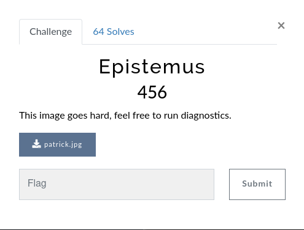
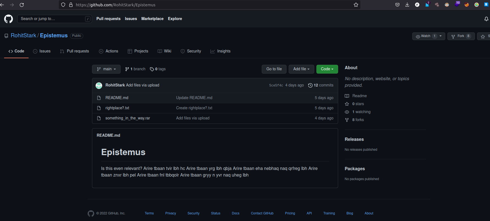
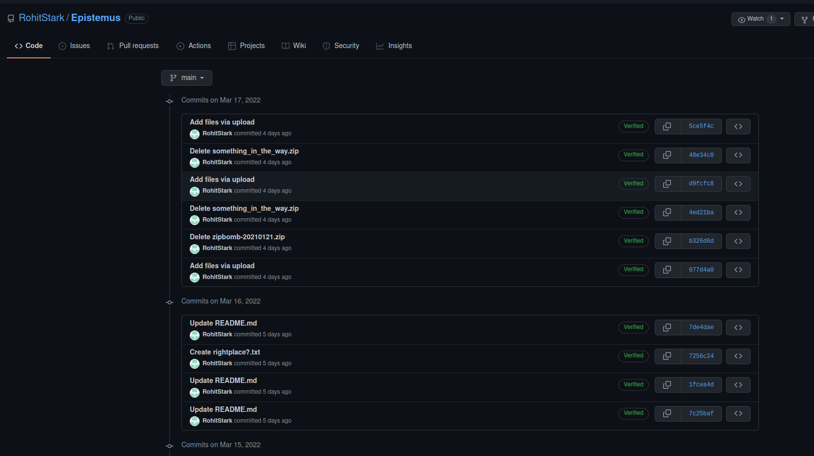

# Epistemus



In this challenge we got jpeg image.
So let's launch ``stegoveritas`` tool :

```
$ stegoveritas patrick.jpg
```

So now let's see what there are in result folder.
In result folder we have contrast image generate by ``stegoveritas`` and we can see than there is url :


URL : **https://github.com/RohitStark/Epistemus**



Here we have 3 files.
But nothing important to flag this challenge.

Now let's see commits history :



Here the important file is `something_in_the_way.zip` so let's download this.

Now the only thing to do is to run `strings` command to read `something_in_the_way.zip` and we get the flag :

```
$ strings something_in_the_way.zip 
[...]
 something_in_the_way/bomb - Copy (99).txt
       
 	 c /mqT
5   
 $ /           
 something_in_the_way/bomb - Copy.txt
       
 	 c /mqT
5   
 /           pl
 something_in_the_way/bomb.txt
       
    u u 
VishwaCTF{th1ng$_a43_n0t_wh4t_th3y_4lw4y$_$33m}

```

FLAG : ``VishwaCTF{th1ng_a43_n0t_wh4t_th3y_4lw4y_$33m}``


PS : There are a lot of rabbit hole like homoglyphe which give you password to decrypt `.rar` file, etc...
