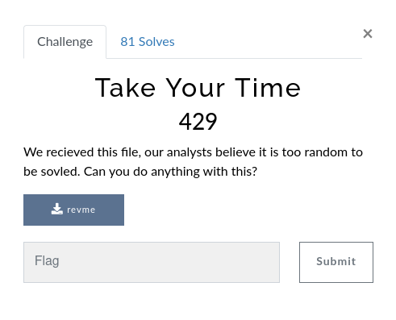

# Take Your Time



In this challenge we have ELF 64-bit binary not stripped :

```
$ file revme 
revme: ELF 64-bit LSB shared object, x86-64, version 1 (SYSV), dynamically linked, interpreter /lib64/ld-linux-x86-64.so.2, BuildID[sha1]=78c3d3682fb7390af718b39dfec9af2475858c3e, for GNU/Linux 3.2.0, not stripped

```

So let's start and disass this binary !

Ghidra decompiler in ``main`` function :

```c

undefined8 main(void)

{
  time_t tVar1;
  uint local_74;
  uint local_70;
  uint local_6c;
  char local_68 [80];
  uint local_18;
  uint local_14;
  uint local_10;
  uint local_c;
  
  tVar1 = time((time_t *)0x0);
  local_10 = (uint)tVar1;
  srand(local_10);
  local_14 = rand();
  local_c = (local_14 - 3) * 3;
  if ((local_c & 1) != 0) {
    local_c = local_c - 1;
  }
  local_18 = (int)local_c / 2 + 7;
  puts("Guess The numbers that i am thinking...");
  printf("Enter first number: ");
  __isoc99_scanf(&DAT_00102045,&local_6c);
  printf("Enter second number: ");
  __isoc99_scanf(&DAT_00102045,&local_70);
  printf("Enter third number: ");
  __isoc99_scanf(&DAT_00102045,&local_74);
  if (((local_14 == local_6c) && (local_c == local_70)) && (local_18 == local_74)) {
    itachi();
  }
  else {
    puts("wrong guess ");
    sprintf(local_68,"%d %d %d %d",(ulong)local_10,(ulong)local_14,(ulong)local_c,(ulong)local_18);
    puts(local_68);
  }
  return 0;
}
```

So in this ``main`` function we can see than a "random" number is generate with seed  (not very random therefore) which is current time.

After we see than there are 3 variables in condition and if this condition is true ``itachi`` function is launch.

So let's see what there are in ``itachi`` function :

```c
void itachi(void)

{
  int local_10;
  int local_c;
  
  b._48_4_ = a._48_4_;
  for (local_c = 0xc; -1 < local_c; local_c = local_c + -1) {
    *(int *)(a + (long)(local_c + -1) * 4) =
         *(int *)(a + (long)(local_c + -1) * 4) - *(int *)(a + (long)local_c * 4);
    *(int *)(b + (long)(local_c + -1) * 4) =
         *(int *)(b + (long)(local_c + -1) * 4) + *(int *)(a + (long)(local_c + -1) * 4);
  }
  for (local_10 = 0; local_10 < 0xd; local_10 = local_10 + 1) {
    putchar(*(int *)(b + (long)local_10 * 4));
  }
  putchar(10);
  return;
}
```

So here we can see lots of operations and a call of ``putchar`` function at the end so that seems to be a function which show flag.

Let's run ``revme`` with ``ltrace``:

```
ltrace ./revme 
time(0)                                          = 1647815274
srand(0x6237aa6a, 0x7ffea2a634d8, 0x7ffea2b44080, 0x55efad498400) = 0
rand(0x7fda3b6d7240, 0x7fda3b6d7740, 0x7fda3b6d71c4, 0xffffffff) = 0x4b0a1705
puts("Guess The numbers that i am thin"...Guess The numbers that i am thinking...
)      = 40
printf("Enter first number: ")                   = 20
__isoc99_scanf(0x55efad499045, 0x7ffea2a6337c, 0, 0Enter first number: 
```

We see than we got ``number1``(local_14 | "random" number) which is used to generate ``number2``(local_c) and ``number3``(local_18) to guess.


Now we might create solver to guess the number 2/3 and get the flag from ``itachi`` function :

```c
#include <stdio.h>

int main(){
    unsigned int random_N = 0x4b0a1705; // number 1

    unsigned int number2 = (random_N - 3) * 3;
    if( (number2 & 1) != 0)
        number2 = number2 - 1;
    unsigned int number3 = (int)number2 / 2 + 7;

    printf("%d %d %d", random_N, number2, number3);
    return 0;
}
```

Output :

```
$ gcc solve.c -o solve && ./solve
1258952453 -518109946 -259054966
```

So now let's just enter the 3 numbers :

```
$ ltrace ./revme 
time(0)                                          = 1647815274
srand(0x6237aa6a, 0x7ffea2a634d8, 0x7ffea2b44080, 0x55efad498400) = 0
rand(0x7fda3b6d7240, 0x7fda3b6d7740, 0x7fda3b6d71c4, 0xffffffff) = 0x4b0a1705
puts("Guess The numbers that i am thin"...Guess The numbers that i am thinking...
)      = 40
printf("Enter first number: ")                   = 20
__isoc99_scanf(0x55efad499045, 0x7ffea2a6337c, 0, 0Enter first number: 1258952453
) = 1
printf("Enter second number: ")                  = 21
__isoc99_scanf(0x55efad499045, 0x7ffea2a63378, 0, 0Enter second number: -518109946
) = 1
printf("Enter third number: ")                   = 20
__isoc99_scanf(0x55efad499045, 0x7ffea2a63374, 0, 0Enter third number: -259054966
) = 1
putchar(116, 0xffffffff, 0, 0xffffff8c)          = 116
putchar(33, 0x55efae9f62a0, 4, 3072)             = 33
putchar(109, 0x55efae9f62a0, 8, 3072)            = 109
putchar(51, 0x55efae9f62a0, 12, 3072)            = 51
putchar(95, 0x55efae9f62a0, 16, 3072)            = 95
putchar(33, 0x55efae9f62a0, 20, 3072)            = 33
putchar(53, 0x55efae9f62a0, 24, 3072)            = 53
putchar(95, 0x55efae9f62a0, 28, 3072)            = 95
putchar(109, 0x55efae9f62a0, 32, 3072)           = 109
putchar(48, 0x55efae9f62a0, 36, 3072)            = 48
putchar(110, 0x55efae9f62a0, 40, 3072)           = 110
putchar(51, 0x55efae9f62a0, 44, 3072)            = 51
putchar(121, 0x55efae9f62a0, 48, 3072)           = 121
putchar(10, 0x55efae9f62a0, 0, 3072t!m3_!5_m0n3y
)             = 10
+++ exited (status 0) +++

```

Yeah we get the flag : ``vishwactf{t!m3_!5_m0n3y}``
